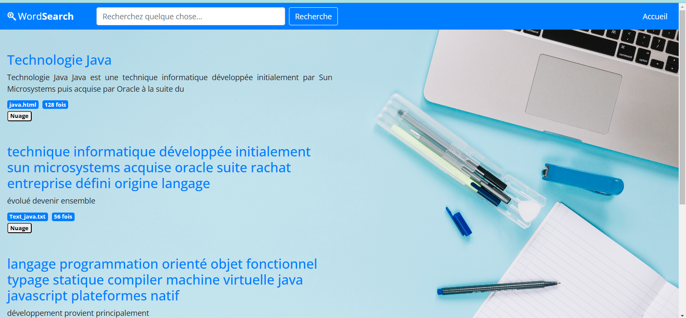
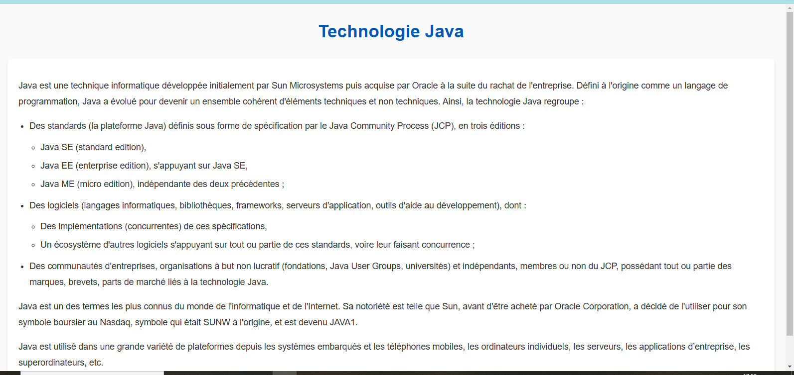
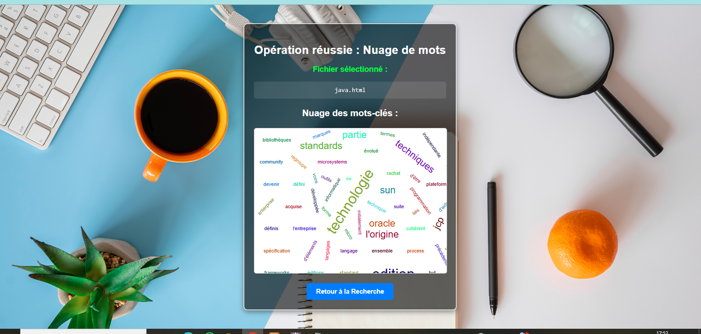
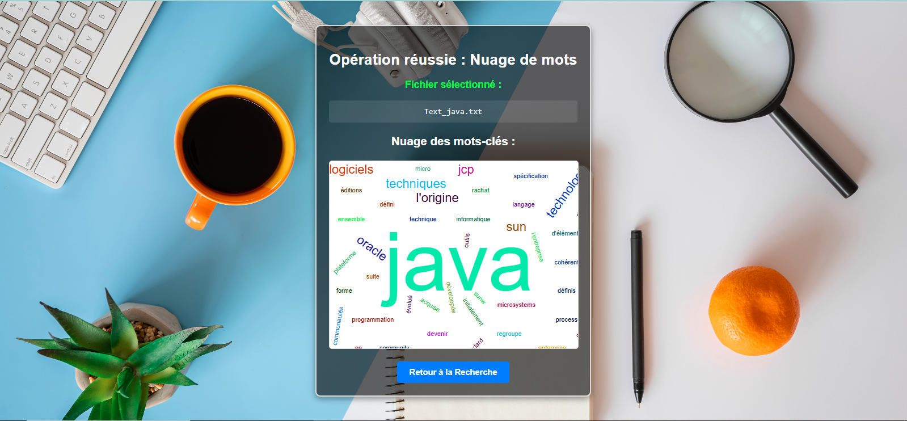
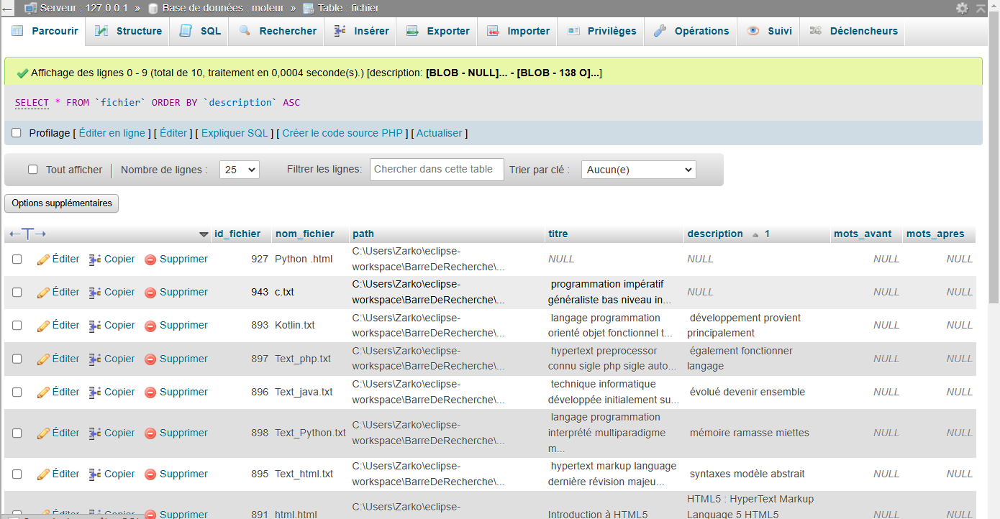
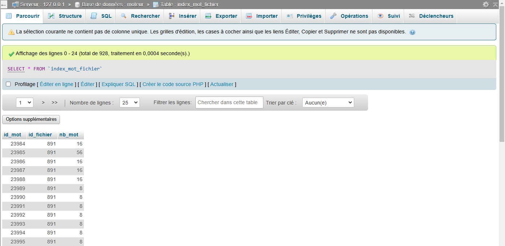
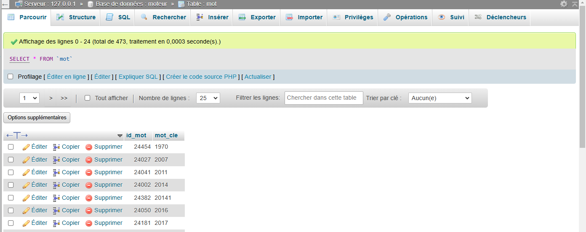

<!-- README.md - Moteur de Recherche de Fichiers -->

<body style="background: linear-gradient(135deg, #f0f9ff 0%, #e0f2fe 100%); margin: 0; padding: 20px;">

<div style="
    background-color: #ffffff;
    border-left: 4px solid #0ea5e9;
    padding: 1.5rem;
    margin: 2rem 0;
    border-radius: 0 8px 8px 0;
    box-shadow: 0 4px 6px rgba(14, 165, 233, 0.15);
">

<p style="font-size: 1.2rem; color: #0c4a6e; font-weight: 500;">Application Web Java EE Full-Stack • Indexation & Recherche Avancée de Fichiers</p>

</div>

<br>

<div align="center" style="
    background: linear-gradient(90deg, #0369a1 0%, #0ea5e9 100%);
    color: white;
    padding: 2.5rem 2rem;
    border-radius: 20px;
    box-shadow: 
        0 15px 35px rgba(14, 165, 233, 0.25),
        inset 0 1px 0 rgba(255, 255, 255, 0.3);
    border: 3px solid rgba(255, 255, 255, 0.2);
    position: relative;
    overflow: hidden;
">
    
<br>

<div style="position: absolute; top: 0; right: 0; padding: 1rem;">
    
    
    
    
    
</div>

<br>

<h1 style="margin-top: 2rem; font-size: 2.8rem;">🔍📂 Moteur de Recherche de Fichiers</h1>
<p style="font-size: 1.1rem; opacity: 0.95; max-width: 800px; margin: 1rem auto; line-height: 1.6;">
Application web <strong>Java EE full-stack</strong> permettant l'indexation et la recherche avancée de fichiers via une interface web interactive.  
Le projet met en œuvre des <strong>algorithmes de recherche multi-critères</strong>, un <strong>classement intelligent des résultats</strong>, des <strong>nuages de mots</strong> et des mécanismes de <strong>mise en cache</strong> pour optimiser les performances.
</p>

</div>

</body>

---

## 📖 Table des Matières

### 🚀 **Présentation & Vision**
- [🎯 Description du Projet](#-description-du-projet)
- [✨ Fonctionnalités Principales](#-fonctionnalités-principales)
- [📱 Aperçu & Démonstration](#-aperçu--démonstration)

### ⚙️ **Architecture & Développement**
- [🏗️ Stack Technologique](#️-stack-technologique)
- [📊 Galerie des Interfaces](#-galerie-des-interfaces)
- [📦 Installation & Configuration](#-installation--configuration)
- [▶️ Guide d'Utilisation](#️-guide-dutilisation)

### 🌐 **Valeur & Communauté**
- [💎 Valeur Professionnelle](#-valeur-professionnelle)
- [🤝 Contribution](#-contribution)
- [📜 Licence](#-licence)
- [📞 Contact](#-contact)

---

## 🎯 Description du Projet

Ce projet consiste en le développement d'un **moteur de recherche de fichiers** complet basé sur **Java EE (Servlet, JSP)** et **MySQL**. Il permet aux utilisateurs de rechercher efficacement des fichiers stockés en base de données selon plusieurs critères (**nom, mots-clés, contenu**), avec une interface web moderne, réactive et performante.

**L'application illustre de manière pratique :**
- Le développement **web full-stack Java EE** de bout en bout.
- La conception et l'optimisation d'**algorithmes de recherche** complexes.
- La **gestion des performances** via la mise en cache et l'indexation intelligente.
- La **visualisation avancée de données** avec des nuages de mots interactifs.

> **💡 Innovation** : Au-delà d'une simple recherche, le système implémente un **classement par pertinence** basé sur la fréquence des termes et une **mise en cache stratégique** pour des réponses ultra-rapides aux requêtes fréquentes.

---

## ✨ Fonctionnalités Principales  

### ✅ **Moteur de Recherche Avancé**
- **Recherche Multi-Critères** : Par nom de fichier, extension, mots-clés ou contenu texte.
- **Algorithmes d'Indexation** : Traitement et indexation efficaces des fichiers pour une recherche rapide.
- **Classement Intelligent (Ranking)** : Les résultats sont triés par **pertinence** calculée sur la fréquence et la position des mots recherchés.
- **Mise en Cache (Caching)** : Les résultats des recherches fréquentes sont mis en cache pour des **temps de réponse optimisés**.

### ✅ **Interfaces Utilisateur Duales**
- **👤 Interface Utilisateur Standard** : Formulaire de recherche intuitif, affichage clair des résultats, visualisation des détails.
- **🔑 Interface Administrateur** : Gestion complète des fichiers indexés, supervision du cache, statistiques d'utilisation.

### ✅ **Visualisation & Données**
- **☁️ Générateur de Nuages de Mots** : Visualisation interactive des termes les plus fréquents dans le corpus de fichiers.
- **📊 Tableaux de Bord** : Suivi des performances et des métriques de recherche.

### ✅ **Performance & Robustesse**
- **Architecture MVC** : Séparation claire des couches (Modèle, Vue, Contrôleur) pour un code maintenable.
- **Connexion Pooling** : Gestion optimisée des connexions à la base de données MySQL.
- **Logging Complet** : Traçabilité des erreurs et du comportement de l'application.

---

## 📱 Aperçu & Démonstration

<div align="center" style="margin: 3rem 0;">
🎯 Interface Utilisateur Principale

<div style="
    max-width: 900px;
    margin: 0 auto;
    padding: 2rem;
    background: linear-gradient(135deg, #f8fafc 0%, #f1f5f9 100%);
    border-radius: 16px;
    border: 3px solid #e2e8f0;
    box-shadow: 0 20px 40px rgba(0, 0, 0, 0.08);
">


<div style="text-align: center; margin-top: 1.5rem;">
    <p style="font-size: 1.5rem; font-weight: 600; color: #1e293b; margin-bottom: 0.5rem;">
        🔍 Interface de Recherche Principale
    </p>
    <p style="color: #64748b; font-size: 1.1rem; max-width: 700px; margin: 0 auto;">
        L'écran d'accueil permet de lancer des recherches multi-critères avec un formulaire intuitif et d'accéder aux fonctionnalités avancées.
    </p>
</div>

</div>

</div>

---

## 📊 Galerie des Interfaces

<div align="center">

<h3>🔑 Panneau d'Administration</h3>

<table>
  <tr>
    <td align="center"><strong>Tableau de Bord Admin</strong><br></td>
    <td align="center"><strong>Gestion des Fichiers</strong><br></td>
  </tr>
  <tr>
    <td align="center"><em>Supervision et statistiques</em></td>
    <td align="center"><em>Interface de gestion du catalogue</em></td>
  </tr>
</table>

<br>

<h3>🔎 Recherche & Résultats</h3>

<table>
  <tr>
    <td align="center"><strong>Interface Utilisateur</strong><br></td>
    <td align="center"><strong>Page des Résultats</strong><br></td>
  </tr>
  <tr>
    <td align="center"><em>Formulaire de recherche avancée</em></td>
    <td align="center"><em>Affichage des résultats classés</em></td>
  </tr>
</table>

<br>

<table>
  <tr>
    <td align="center"><strong>Résultats Détail</strong><br></td>
    <td align="center"><strong>Fiche Fichier</strong><br></td>
  </tr>
  <tr>
    <td align="center"><em>Vue alternative des résultats</em></td>
    <td align="center"><em>Fiche descriptive complète</em></td>
  </tr>
</table>

<br>

<h3>☁️ Visualisation de Données</h3>

<table>
  <tr>
    <td align="center"><strong>Nuage de Mots 1</strong><br></td>
    <td align="center"><strong>Nuage de Mots 2</strong><br></td>
  </tr>
  <tr>
    <td align="center"><em>Visualisation des termes fréquents</em></td>
    <td align="center"><em>Autre représentation du nuage</em></td>
  </tr>
</table>

<br>

<h3>🗄️ Modèle de Données</h3>

<table>
  <tr>
    <td align="center"><strong>Schéma Base de Données</strong><br></td>
    <td align="center"><strong>Détail des Tables</strong><br></td>
  </tr>
  <tr>
    <td align="center"><em>Architecture globale de la base</em></td>
    <td align="center"><em>Structure des tables principales</em></td>
  </tr>
</table>

<table>
  <tr>
    <td align="center"><strong>Vue Relationnelle</strong><br></td>
  </tr>
  <tr>
    <td align="center"><em>Schéma relationnel complet</em></td>
  </tr>
</table>

</div>

---

## 🏗️ Stack Technologique

### 🔧 **Backend & Serveur**

| Technologie | Rôle dans le Projet |
|-------------|---------------------|
| **Java EE** | Plateforme complète pour le développement d'applications d'entreprise. |
| **Servlets** | Gestion des requêtes HTTP, contrôleur principal de l'architecture MVC. |
| **JSP (JavaServer Pages)** | Génération dynamique des vues HTML. |
| **MySQL** | Base de données relationnelle pour stocker les métadonnées des fichiers, les index de recherche et les logs. |
| **JDBC** | Connecteur pour les interactions entre Java et la base de données MySQL. |
| **Apache Tomcat** | Serveur d'applications web/serveur Servlet pour le déploiement. |

### 🎨 **Frontend & Interface**

| Technologie | Rôle dans le Projet |
|-------------|---------------------|
| **HTML5** | Structure sémantique des pages web. |
| **CSS3** | Mise en forme, design responsive et création de l'interface utilisateur moderne. |
| **JavaScript** | Interactivité côté client, validation des formulaires, et appels AJAX pour des mises à jour dynamiques. |
| **JSTL (JSP Standard Tag Library)** | Simplification de l'écriture du code JSP pour l'affichage des données. |

### 🧰 **Architecture & Méthodologie**

| Concept | Application dans le Projet |
|---------|----------------------------|
| **Architecture MVC** | Séparation stricte entre la logique métier (Modèle), l'interface (Vue) et le contrôleur (Servlet). |
| **Algorithmes de Recherche** | Implémentation de mécanismes de recherche par mot-clé, classement par pertinence (TF-IDF simplifié). |
| **Mise en Cache (Caching)** | Stratégie pour stocker les résultats de requêtes fréquentes et améliorer les performances. |
| **Conception de Base de Données** | Modélisation relationnelle optimisée pour les opérations de recherche et d'indexation. |
| **Eclipse IDE** | Environnement de développement intégré principal. |

---

## 📦 Installation & Configuration

### **Prérequis**
- **Java JDK 8+** (Java Development Kit)
- **Apache Tomcat 9+** (Serveur d'applications)
- **MySQL Server 5.7+** (Base de données)
- **Eclipse IDE for Enterprise Java Developers** (avec les plugins Web et Java EE)
- **Git** (pour cloner le dépôt)

### **Étapes de Déploiement Détaillées**

1.  **Cloner et Préparer le Projet :**
    ```bash
    git clone https://github.com/krikounoureddine/Moteur-de-recherche-de-fichiers.git
    cd Moteur-de-recherche-de-fichiers
    ```

2.  **Configurer la Base de Données MySQL :**
    - Démarrez votre serveur MySQL.
    - Créez une nouvelle base de données (ex: `file_search_engine`).
    - Exécutez le script SQL fourni (`database/schema.sql`) pour créer les tables.
    - (Optionnel) Exécutez le script `database/seed_data.sql` pour peupler la base avec des données d'exemple.

3.  **Configurer la Connexion à la Base de Données :**
    - Localisez le fichier de configuration (ex: `context.xml` dans `META-INF/` ou un fichier `.properties`).
    - Mettez à jour les paramètres de connexion (URL, utilisateur, mot de passe) pour qu'ils correspondent à votre installation MySQL.

4.  **Importer et Configurer dans Eclipse :**
    - Ouvrez Eclipse et importez le projet comme **"Existing Projects into Workspace"**.
    - Assurez-vous que le **Target Runtime** est configuré sur votre serveur Tomcat.
    - Ajoutez les bibliothèques nécessaires (JDBC Driver pour MySQL) au **Build Path** du projet.

5.  **Déployer et Démarrer :**
    - Publiez le projet sur votre serveur Tomcat depuis Eclipse.
    - Démarrez le serveur Tomcat.
    - Accédez à l'application via votre navigateur à l'adresse : `http://localhost:8080/[nom-du-projet]`.

---

## ▶️ Guide d'Utilisation

### **Pour l'Utilisateur Final**
1.  **Accédez à la page d'accueil** : Le formulaire de recherche principal s'affiche.
2.  **Saisissez vos critères** : Entrez un ou plusieurs mots-clés, choisissez éventuellement un type de fichier.
3.  **Lancez la recherche** : Cliquez sur "Rechercher". Les résultats, classés par pertinence, s'affichent.
4.  **Explorez les résultats** : Consultez les fiches détaillées des fichiers ou utilisez le **nuage de mots** pour identifier les termes dominants.

### **Pour l'Administrateur**
1.  **Connectez-vous** à l'interface d'administration (généralement via `/admin`).
2.  **Gérez le contenu** : Ajoutez, modifiez ou supprimez des fichiers de l'index de recherche.
3.  **Supervisez les performances** : Consultez les statistiques de recherche, l'état du cache et les logs système.
4.  **Générez des rapports** : Visualisez l'activité et l'efficacité du moteur de recherche.

> **💡 Astuce** : Pour des recherches très précises, utilisez la **recherche avancée** qui permet de combiner plusieurs filtres (date, taille, auteur, etc.).

---

## 💎 Valeur Professionnelle

### ✅ **Ce que ce projet démontre concrètement**

Ce **Moteur de Recherche de Fichiers** n'est pas un simple exercice académique. C'est une application **Java EE full-stack complète** qui valide des compétences techniques recherchées sur le marché :

1.  **Maîtrise de Java EE (Servlets, JSP, JDBC)** : Développement côté serveur robuste et structuré.
2.  **Conception et Optimisation d'Algorithmes** : Implémentation d'un moteur de recherche avec classement intelligent et mise en cache.
3.  **Gestion de Base de Données Relationnelle** : Modélisation SQL (MySQL), requêtes complexes et optimisation.
4.  **Développement Frontend Intégré** : Création d'une interface utilisateur interactive, moderne et responsive (HTML, CSS, JS).
5.  **Pensée Système et Performance** : Prise en compte de l'architecture (MVC), de la scalabilité et des mécanismes de cache.

### 🎯 **Pour les Recruteurs & Lead Developers**
Ce projet montre que le candidat est capable de :
- **Prendre en charge un projet web complet** de A à Z, du backend au frontend.
- **Résoudre un problème métier complexe** (la recherche d'information) avec une solution technique élégante.
- **Travailler avec une stack Java EE traditionnelle mais toujours pertinente** dans de nombreux environnements d'entreprise.
- **Documenter et présenter** son travail de manière claire et professionnelle.

> ⭐ **Ce projet est un atout majeur pour tout poste de Développeur Java Backend, Full-Stack ou en transition vers l'architecture.**

---

## 🤝 Contribution

Les retours et contributions sont les bienvenues pour améliorer ce moteur de recherche, qu'il s'agisse d'optimisations, de nouvelles fonctionnalités ou de corrections.

### **Comment Contribuer ?**
1.  **Ouvrir une Issue** : Pour signaler un bug, suggérer une amélioration ou poser une question.
2.  **Proposer du Code (Pull Request)** :
    ```bash
    # 1. Forkez le dépôt sur GitHub
    # 2. Clonez votre fork localement
    git clone https://github.com/votre-utilisateur/Moteur-de-recherche-de-fichiers.git
    # 3. Créez une branche pour votre fonctionnalité
    git checkout -b feature/nouvelle-fonctionnalite
    # 4. Développez, testez et committez vos changements
    git commit -m "feat: ajout de la recherche par expression exacte"
    # 5. Poussez vers votre fork et ouvrez une Pull Request
    ```

### **Axes d'Amélioration Prioritaires**
- **Performance** : Intégration d'un moteur d'indexation plus avancé (comme Lucene) en backend.
- **UX/UI** : Refonte de l'interface avec un framework CSS moderne (Bootstrap, Tailwind).
- **Fonctionnalités** : Recherche plein texte dans le contenu des fichiers (PDF, DOCX), suggestions de recherche.
- **Tests** : Augmentation de la couverture par des tests unitaires et d'intégration.

---

## 📜 Licence

Ce projet est distribué sous la licence **MIT**, une licence open-source permissive.


---

## 📞 Contact

### 👤 **Noureddine Krikou**
**💼 Développeur Java Full-Stack & Architecte Logiciel**

[](https://github.com/krikounoureddine)
[](https://krikounoureddine.github.io)
[](https://www.linkedin.com/in/noureddine-krikou)

📧 **Une question technique, un retour ou une opportunité ?**

[](mailto:contact@krikou.dev)

---

### 🔍📂 Moteur de Recherche de Fichiers • Performance et Intelligence dans la Recherche d'Information.

[](https://github.com/krikounoureddine/Moteur-de-recherche-de-fichiers)

[](https://www.oracle.com/java/technologies/java-ee-glance.html)


------------------------------

# 🔍📂 Moteur de Recherche de Fichiers

## 📌 Description

Ce projet consiste en le développement d'un **moteur de recherche de fichiers** permettant aux utilisateurs de rechercher des fichiers stockés dans une base de données en utilisant plusieurs critères (**nom, mots-clés**). L'application propose une **interface utilisateur intuitive** et une **gestion efficace des requêtes** pour offrir une expérience de recherche optimisée.  

🖼️ **Aperçu du projet**  
  

---

## 🎯 Fonctionnalités principales

✅ **Système d'indexation et de recherche avancée** : Basé sur **Java EE (Servlet, JSP)** et **MySQL**.  
✅ **Interface utilisateur interactive** 🎨 : Développée en **HTML, CSS et JavaScript**.  
✅ **Gestion dynamique des requêtes** ⚡ : Résultats générés et affichés en temps réel via **Servlets et JSP**.  
✅ **Optimisation des performances** 🚀 : Mise en cache des résultats fréquemment demandés pour améliorer la réactivité.  
✅ **Classement intelligent des résultats** 📊 : Les fichiers sont triés en fonction du **nombre de répétitions des mots-clés recherchés**.  
✅ **Nuages de mots** ☁️ : Visualisation des **termes dominants** dans les fichiers à l'aide de **nuages de mots**.  

---

## 📲 Captures d'Écran  

### 🔑 Interface Administrateur  

🖼️ **Tableau de bord admin**  
  

🖼️ **Gestion des fichiers**  
  

### 👤 Interface Utilisateur  

🖼️ **Accueil utilisateur**  
  

### 🔎 Résultats de Recherche  

🖼️ **Affichage des résultats**  
  

🖼️ **Affichage détaillé**  
  

### 📑 Détails des Résultats  

🖼️ **Informations sur un fichier**  
  

### ☁️ Nuage de Mots  

🖼️ **Visualisation des mots-clés**  
  

🖼️ **Autre exemple**  
  

### 🗄️ Base de Données  

🖼️ **Schéma de la base de données**  
  

🖼️ **Détail des tables**  
  

🖼️ **Autre vue**  
  

---

## 🛠️ Stack technologique  

🔹 **Backend** 🖥️ : Java EE (Servlet, JSP), MySQL  
🔹 **Frontend** 🎨 : HTML, CSS, JavaScript  
🔹 **IDE** 🏗️ : Eclipse  

---

## 📋 Prérequis  

Avant de démarrer, assurez-vous d'avoir les éléments suivants installés :  

🔹 **Java (JDK 8 ou supérieur)** ☕  
🔹 **Apache Tomcat** ou un autre serveur compatible avec Java EE 🌍  
🔹 **MySQL** 🗄️  
🔹 **Eclipse IDE pour Java EE** (ou un autre IDE compatible) 💻  
🔹 **Maven** (si vous souhaitez gérer les dépendances) 📦  

---

🎯 **Prêt à commencer ? 🚀**  
Clonez ce projet et démarrez votre serveur pour explorer le moteur de recherche !  
